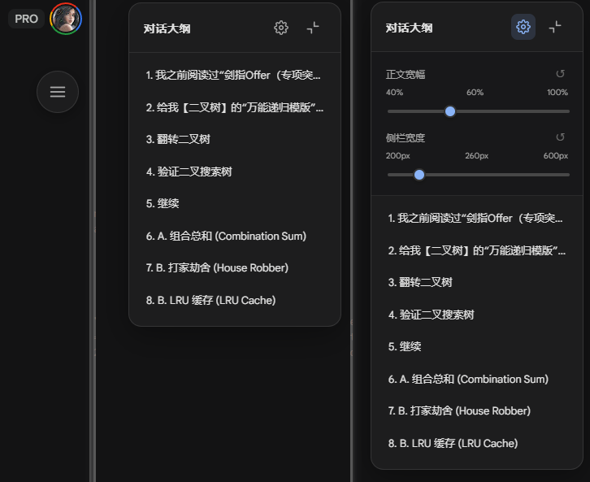

# gemini-read-enhance-plugin

Gemini Read Enhance

Gemini 对话大纲与宽屏工具：为 Google Gemini 提供沉浸式宽屏阅读体验，并自动生成侧边栏对话大纲，支持一键导航与自定义宽度。

## 如何使用？

- [下载已发布的zip](https://github.com/Juna3066/gemini-read-enhance-plugin/releases/tag/v2.7.0)
- 进入**扩展程序页面**（chrome地址输入`chrome://extensions/`）
- 开启右侧**开发者模式**
- 把下载zip包拖进**扩展程序页面**

## 配合SingleFile插件使用（可选）

- 进入**扩展程序页面**（chrome地址输入`chrome://extensions/`）
- 点击Gemini Read Enhance插件**详情**
- 开启**允许访问文件网址**
- 点击SingleFile插件**详情**
- 点击**扩展程序选项**
- 点击**HTML内容**
- 在**移除特定元素**框里添加`#my-gemini-toc`
- 网页Gemini对话页面-右键-SingleFile-使用SingleFile保存页面
- 浏览器打开本地**已保存页面**查看
